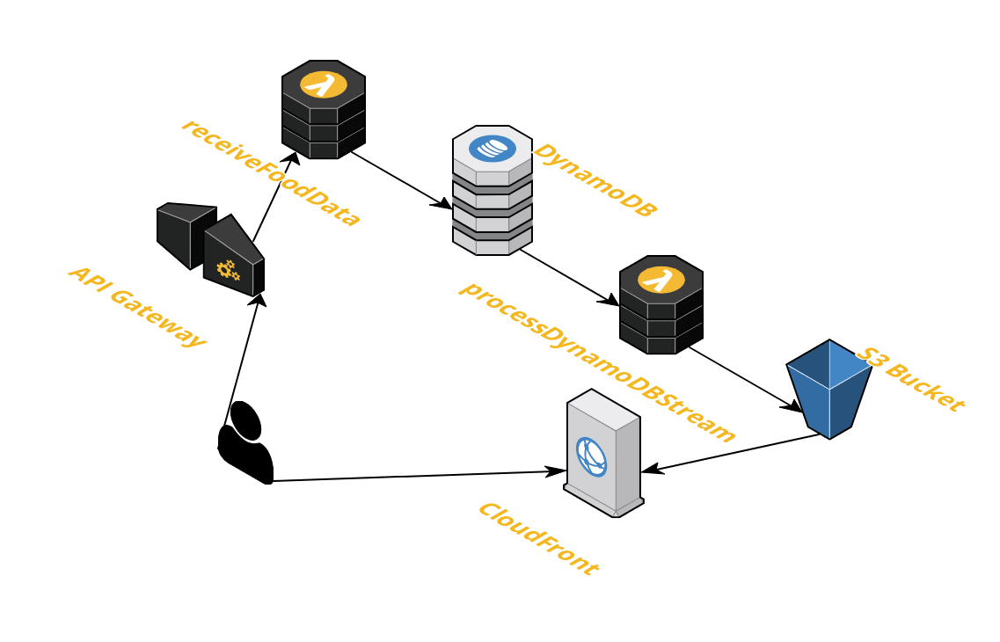

### Haven&Hearth Food Data Service

The goal of this service is to automate the task of gathering information about food existing in the game

The idea is to automatically send information for every item with obtainable base FEP values. 
This information will be stored in the JSON format and available for everyone to use

The service consists of 3 parts:
 - Client integration - prepares and sends data
 - Serverless backend - receives data, processes and stores
 - Frontend application - provides ability to view stored data

You can access application at: https://food.havenandhearth.link/

Data file is available at: https://food.havenandhearth.link/data/food-info.json

(note: json file is stored in the uglified format, see frontend section for more info)
 
#### Client integration

Sample integration with Amber's client can be found [here](https://github.com/APXEOLOG/amber/pull/2)

Few points:
 - No excessive information sent
 - Base FEPs calculated on the client
 - Food with non-calculable FEPs skipped (like Peppered food)
 - To ensure uniqueness hash is generated based on food name, resource name, ingredients
 
Example data sent from the client: 
```json
[
  {
    "itemName": "Autumn Steak",
    "ingredients": [
      {
        "percentage": 100,
        "name": "Black Pepper"
      },
      {
        "percentage": 100,
        "name": "Heartwood Leaves"
      },
      {
        "percentage": 100,
        "name": "Pork bollock"
      },
      {
        "percentage": 100,
        "name": "Fairy Mushroom"
      }
    ],
    "resourceName": "gfx/invobjs/autumnsteak",
    "feps": [
      {
        "name": "Perception +2",
        "value": 14.99
      },
      {
        "name": "Perception +1",
        "value": 45.9
      },
      {
        "name": "Constitution +1",
        "value": 13.14
      },
      {
        "name": "Intelligence +1",
        "value": 6.43
      },
      {
        "name": "Strength +2",
        "value": 131.4
      }
    ],
    "hunger": 1,
    "energy": 800
  },
  {
    "itemName": "Spitroast Lynx",
    "ingredients": [],
    "resourceName": "gfx/invobjs/meat",
    "feps": [
      {
        "name": "Intelligence +1",
        "value": 2
      },
      {
        "name": "Agility +1",
        "value": 2
      },
      {
        "name": "Strength +1",
        "value": 1
      }
    ],
    "hunger": 2,
    "energy": 250
  }
]
```

#### Backend

Backend is implemented via AWS Serverless stack

Overview:
 - All API requests from the client are coming to the Api Gateway
 - Api Gateway invokes `receiveFoodData` lambda, which processes data and put into DynamoDB
 - `processDynamoDBStream` lambda is invoked by DynamoDB Stream when new (not one which already exists) item stored into the DynamoDB. 
 This lambda merges new items into json file stored in the S3 bucket
 - S3 bucket stores json data, as well as frontend application and provides access via Static Website Hosting feature
 - Finally CloudFront manages domains and HTTPS routing 
 
Fancy diagram: 


The architecture is build around free-tier aws services. Estimated monthly maintenance price is around $0.5 (actually the only non free-tier resource here is S3 bucket) 

##### Deployment

Deployment is done using [Terraform](https://learn.hashicorp.com/terraform?track=getting-started#getting-started)

To deploy your own version you need to:
 - Have AWS account
 - Install aws cli and configure it
 - Install terraform
 - Build lambdas (see lambdas folder for more info)
 - Run `terraform apply`, enter aws profile name and target region
 - Wait a little bit :)
 
CloudFront configuration is done manually if required (only if you want fancy custom domain and https)

#### Frontend

Frontend is very simple and right now functions as a placeholder

It is done using Vue.js and just loads json file and displays food table

The `food-data.json` file is stored in the uglified format to reduce costs and increase transport speed.
All field names are replaced with single letters. Format description:
```typescript
export interface MinifiedFoodInfo {
    t: string; // title
    r: string; // resource
    e: number; // energy
    h: number; // hunger
    i: { // ingredients
        n: string; // name
        v: number; // value
    }[];
    f: { // feps
        n: string; // name
        v: number; // value
    }[];
}
```